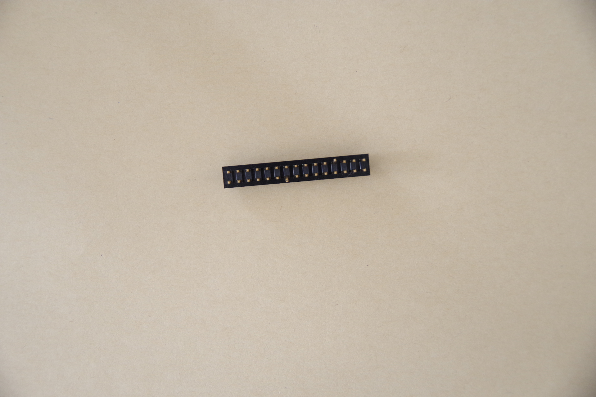
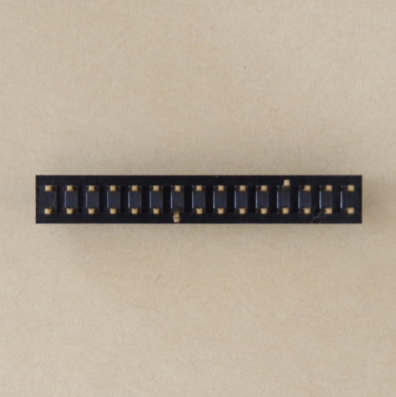

# Image alignment for image preprocessing

Image preprocessing script wchich can be used to align the image subject as follows.
   
   Non-Aligned Image  Aligned Image  


# Table of Contents
 [Requirements](#requirement) | [Detailed Documentation](#detailed-documentation) | [Some constrains](#some-constrains)

# Requirement

- Ubuntu 20.04 & 22.04 or Windows 10 & Windows 11
- Python 3.8.*
- numpy 1.24.4
- opencv-python 4.8.1


  
******************

# Detailed Documentation

### Data Preparation

Prepare a data set with the following structure

```
C:
│ 
└── image_alignment
    ├── data
    │   └──001
    │       ├── good
    │       │    └── [SOME GOOD IMAGE]
    │       ├── bad
    │            └── [SOME BAD IMAGE]
    └── main.py
```

### Startup
Run this code to process the dataset
```sh
python main.py --padding=50 --input=data\\001 --output=results --min_threshold=100 --max_threshold=250 --height_factor=5.03
```

#### parameter reference
```sh    
    input:      →     dataset path
    output:      →      Result path
    min_threshold:      →    minimum threshold for gray scale conversion   
    max_threshold:      →    maximum threshold for gray scale conversion
    padding:            →    after align the subject image will be cropped, padding is to add the pixel around the subject
    height_factor:      →    after adding the pixel, if the subject is rectangular then this factor will be adjusted for making the image square
```

#### Output after processing
```
C:
│ 
└── image_alignment
    ├── data
    │   └──001
    │       ├── good
    │       │    └── [SOME GOOD IMAGE]
    │       ├── bad
    │            └── [SOME BAD IMAGE]
    ├── results
    │   └──001
    │       ├── good
    │       │    └── [SOME GOOD IMAGE]
    │       ├── bad
    │            └── [SOME BAD IMAGE]
    └── main.py

```
# End